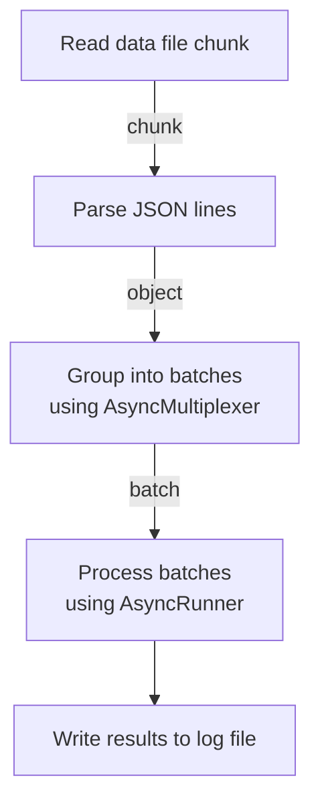
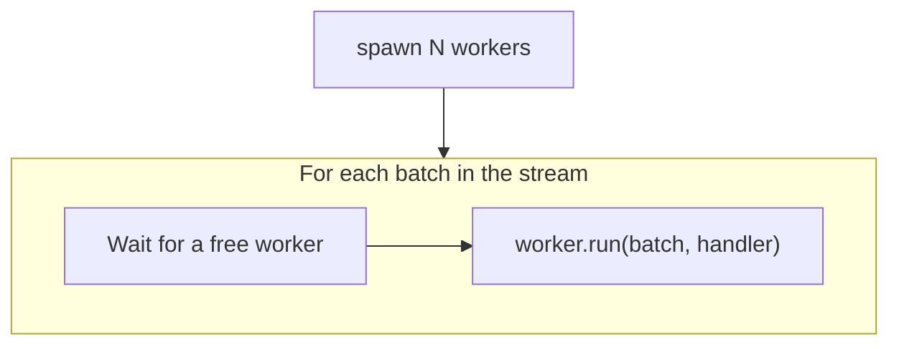

# concurrent-workers-example

## Pipeline

## How async runner works

Let's say concurrency factor is `N`. And `handler` is a user-defined function performing some useful work.

## How workers work

User defines a handler function that would be called for each data item. This function is expected to return a `HandlerResponse` object, containing a `kind` property and a `value` property. `kind` is one of: `success`, `error` or `ratelimit`.

`AsyncRunner` calls a `worker.handle()` function passing it a data item and a handler function. Worker is considered busy if it is already processing a request and free otherwise.

`AsyncRunner` internally manages a workers pool and only performs a `worker.run()` call if there is a free worker available.
